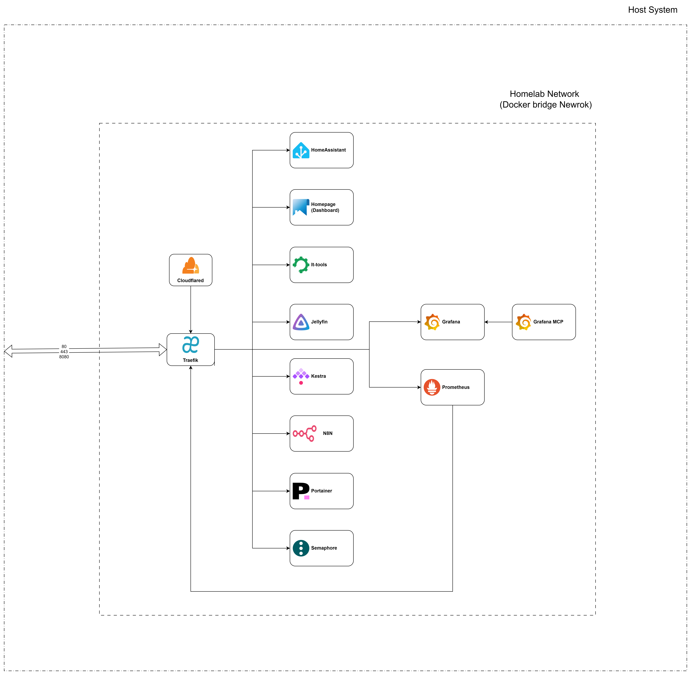

# About this Project
This is Docker Homelab setup made to learn and experiment with various self-hosted services using Docker containers. All completely managed through Docker Compose for easy deployment and management.

> This project is made for personal learning and experimentation purposes and may not be using all best practices for production environments.


# Services
- **Cloudflare Tunnel**: Securely expose your local services to the internet without opening ports.[Readme](./cloudflare/Readme.md)
- **Grafana**: Monitor and visualize metrics from various data sources.
  - "Grafana MCP": An MCP(Model Context Protocol) server/service for Grafana.
- **Home Assistant**: Open-source home automation platform to control smart devices.
- **Homepage(Dashboard)**: A customizable dashboard to access all your services in one place.
- **It-tools**: A collection of network and system administration tools.
- **Jellyfin**: A media server for streaming your personal media collection.
- **Kestra**: A workflow orchestration and scheduling platform.
- **N8N**: A workflow automation tool to connect various services and automate tasks.
- **Portainer**: A web-based Docker management tool.
- **Prometheus**: A monitoring and alerting toolkit.
- **Semaphore**: A  Web-based tool for managing and running Ansible,Terraform and other scripts.
- **Traefik**: A reverse proxy and load balancer for managing access to your services.

# Prerequisites
- Access to a Docker environment with Docker Compose installed.
- Create a Docker network named `homelab`.
- Set LOCAL_DOMAIN and PUBLIC_DOMAIN environment variables in a `.env` file at the root of the project.
  - Example `.env` content:
    ```bash
    LOCAL_DOMAIN=local.example.com  # Can be any domain you use for local access
    PUBLIC_DOMAIN=public.example.com # Your public domain for external access (Optional)
    ```
# How to Run
1. Clone this repository to your local machine.
   ```bash
   git clone https://github.com/KrishnaChaitanya20/Docker_Homelab.git
    cd Docker_Homelab
    ```
2. Check readme files in each service directory for any specific configuration or environment variables that need to be set.
3. Customize the `compose.yaml` file as needed to configure your services.
4. Start the services using Docker Compose.
   ```bash
   docker compose up -d <service-name> [<service-name> ...]
   ```
    or to start all services:
    ```bash
    docker compose --profile all up -d
    ```
    > Check each service's compose file for specific profiles if needed.

# Contributing
Feel free to fork this repository and submit pull requests with improvements or additional services.